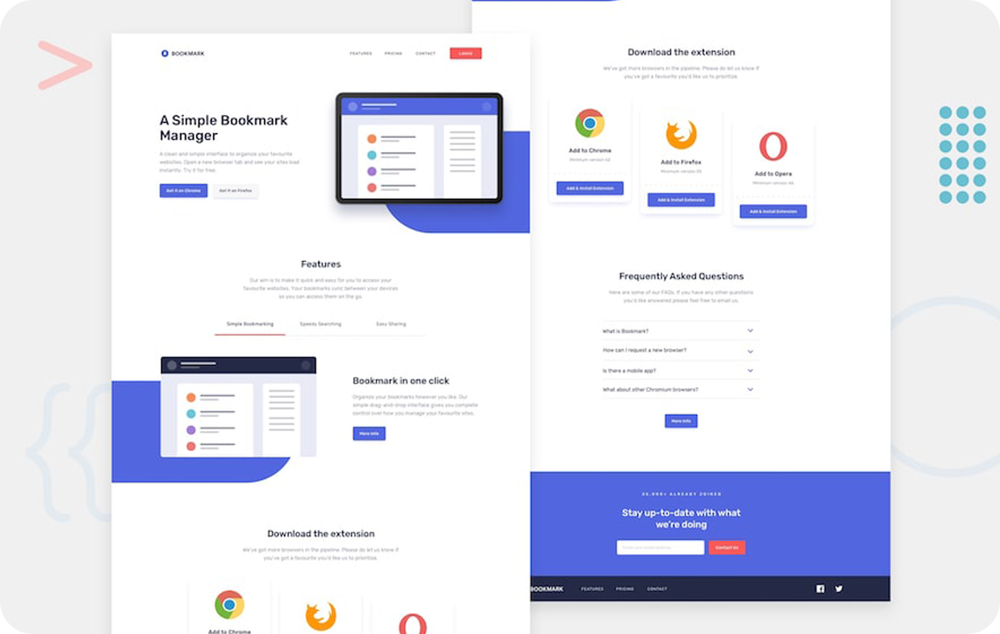

# IT Academy Specialization [ Sprint 01.2 ]

## Description

Welcome to the Sprint 01.2 project of the IT Academy Specialization!

In this project, your goal is to build a landing page and make it resemble the provided design as closely as possible. Here are some key guidelines and considerations you should keep in mind:

### Key Considerations

- Avoid adding unnecessary Bootstrap classes to divs.
- Respect the `container` -> `row` -> `col` structure.
- Ensure the graphic appearance of the website is respected; in this delivery, we will avoid excessive creativity.
- Make sure that the "bootstrap.bundle.min.js" file is loaded, as many Bootstrap components require it.

### Bootstrap Guidelines

- Use Bootstrap components whenever possible, such as buttons, cards, navigation menus, tooltips, and more. This will save you time and maintain consistency in your website.
- Never modify the classes of the original Bootstrap files.
- Position elements using Bootstrap's margin and padding classes. This practice will simplify your CSS files, especially in larger projects.
- Customize the default Bootstrap theme to adapt it to your website's styles using SASS. You don't need to create new classes; you can adjust Bootstrap to meet your needs, including default paddings, theme colors, and margins.

## Technologies Used

In this project, you will work with the following technologies and tools:

- **HTML5:** For the basic structure and organization of web content.
- **CSS3:** To apply styles and visual enhancements to your designs.
- **Bootstrap:** To streamline development and maintain design consistency.
- **SASS:** To customize the Bootstrap theme and tailor it to your needs.
- **Visual Studio Code:** As your code editor for writing, editing, and organizing your projects.

## Your Challenge

Your challenge in this project is to build a landing page following the guidelines and considerations mentioned above. Ensure it closely resembles the provided design and is well-structured.

## Badges/Shields

Development Skills

Design Skills

Build with

## Acknowledgments

Sprint 01.2 is made possible by the amazing IT Academy community and its vibrant Discord group.

## About Me

I'm a junior web developer with a passion for turning wireframes into beautiful web layouts. I'm here to share the knowledge I've gained with everyone who's on a similar journey.

## Contact

If you have any questions or suggestions, feel free to reach out to me via email: [codenaud@gmail.com](mailto:codenaud@gmail.com).

Happy coding! 🚀
